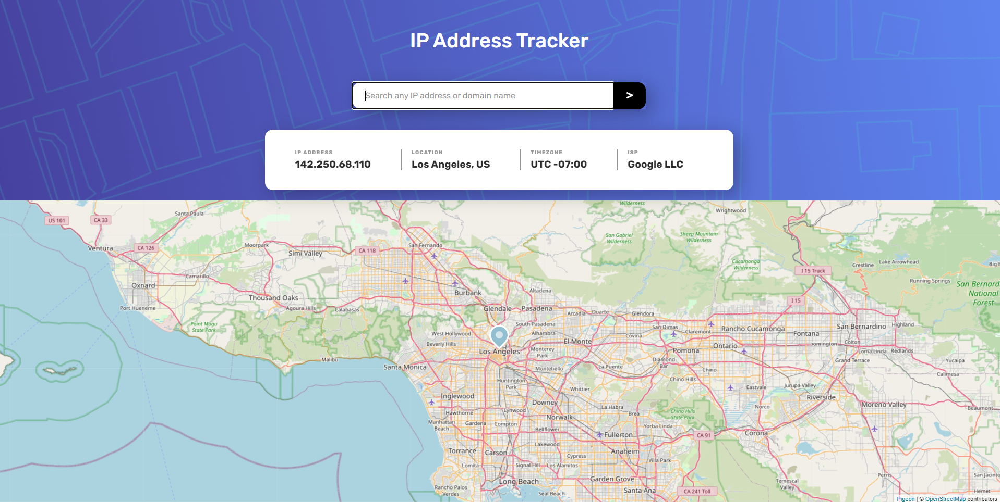

# Frontend Mentor - IP address tracker solution

This is a solution to the [IP address tracker challenge on Frontend Mentor](https://www.frontendmentor.io/challenges/ip-address-tracker-I8-0yYAH0). Frontend Mentor challenges help you improve your coding skills by building realistic projects. 

## Table of contents

- [Overview](#overview)
  - [The challenge](#the-challenge)
  - [Screenshot](#screenshot)
  - [Links](#links)
- [My process](#my-process)
  - [Built with](#built-with)
  - [What I learned](#what-i-learned)
  - [Continued development](#continued-development)
  - [Useful resources](#useful-resources)
- [Author](#author)
- [Acknowledgments](#acknowledgments)

## Overview

### The challenge

Users should be able to:

- View the optimal layout for each page depending on their device's screen size
- See hover states for all interactive elements on the page
- See their own IP address on the map on the initial page load
- Search for any IP addresses or domains and see the key information and location

### Screenshot

### Links

In order for this to work properly you need to provide an API key from <link>ipify.com</link> and put it into the <code>API_KEY</code> variable in <code>App.js</code>. The registration on ipify.com is free of charge for up to 1,000 API calls.

- Solution URL: [github](https://github.com/pawelpikus/ip-address-tracker)

## My process

### Built with

- Flexbox
- Mobile-first workflow
- [React](https://reactjs.org/)   
- [Pigeaon Map API](https://pigeon-maps.js.org/) - ReactJS maps without external dependencies
- [ipify API](https://www.ipify.org/) - A Simple Public IP Address API
- [Font Awsome](https://fontawesome.com/) - the web's most popular icon set and toolkit

### What I learned

I've practiced the use of Hooks (useState, useEffect) and calling APIs. Tried to validate the input value with <code>pattern</code> attribute but the regex I found on Stack Overflow doesn't seem to do a trick, at least for the domain names. 

### Continued development

I need to dwell into the react advanced topics, understand Context, Redux and Router. 

## Author

- Frontend Mentor - [@pawelpikus](https://www.frontendmentor.io/profile/pawelpikus)

## Acknowledgments

Thanks frontendmentor.io for super cool challenges!
